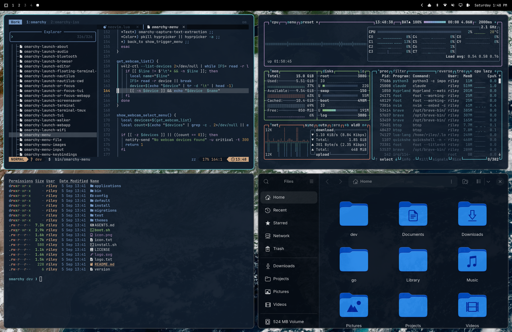

# Omarchy Satellite Theme

An [Omarchy](https://omarchy.org) theme whose wallpaper is live satellite imagery of Earth over
your location, and whose colors are pulled from that imagery: ocean for backgrounds, cloud tops
for text, shallow water for the accent, forest, sand, and soil for the rest.



The wallpaper comes from NOAA's GOES-19 GeoColor product, which updates every five minutes and
blends visible light by day with city lights at night. No account or API key is needed.

## What it does

- Every 10 minutes, a systemd user timer asks NOAA for the frame's timestamp with a HEAD request.
  An unchanged frame costs a few hundred bytes and finishes in about a tenth of a second.
- A new frame is downloaded into tmpfs, cropped around your configured point at your display's
  native resolution, handed to Omarchy, and the source is discarded. The previous wallpaper frame
  is deleted the moment the new one is applied, so exactly one image ever lives on disk.
- The refresh runs at the lowest CPU and IO priority.
- Switching to the theme triggers an immediate refresh.

## Install

```bash
git clone https://github.com/pat-riley/omarchy-satellite-theme.git
cd omarchy-satellite-theme
./install.sh
```

Dependencies: `curl`, `jq`, ImageMagick (`magick`), and systemd, all present on a stock Omarchy
install. `node` is only needed to regenerate the color palette.

`omarchy theme install <url>` also works, but installs the colors only, without the live wallpaper.

## Set your location

The default center is Nashville, Tennessee. Edit `~/.config/omarchy/satellite-bg.conf`:

```
CENTER_X=2628   # pixel coordinates in NOAA's 5000x3000 CONUS image
CENTER_Y=999
ZOOM=1.0        # 1.5 or 2.0 zooms in (softer); below 1 zooms out
```

To find your coordinates, download the source image and crop a test region with a marker until
the dot lands on your city. State and country borders are drawn in the image, which makes this
quick:

```bash
curl -sLo conus.jpg https://cdn.star.nesdis.noaa.gov/GOES19/ABI/CONUS/GEOCOLOR/5000x3000.jpg
X=2628; Y=999
magick conus.jpg -crop 1000x650+$((X-500))+$((Y-325)) +repage \
  -fill red -draw "circle 500,325 500,331" check.jpg
```

Then apply: `omarchy-satellite-bg --force`.

Outside the continental US, change `SOURCE_URL` to another GOES sector or to GOES-West,
Himawari, or Meteosat imagery. Anything NOAA STAR publishes as a JPEG works, as long as you
recalibrate the center point for that image.

## Regenerate the colors

`colors.toml` ships pre-derived from a September 2026 frame. To derive it from whatever is on
your screen right now:

```bash
omarchy-satellite-palette            # print the palette it would produce
omarchy-satellite-palette --apply    # write colors.toml
omarchy theme set satellite          # re-render every app from it
```

The generator clusters the frame's dominant colors and classifies them as ocean, cloud, forest,
sand, soil, and shallow water. Earth imagery has no red or magenta, so those two are hue-shifted
from the desert and ocean tones. Text contrast against the background is enforced at 9:1 or
better. This is deliberately not on the timer, since re-rendering a theme reloads terminals.

## GTK apps follow the theme too

Omarchy doesn't theme GTK and libadwaita apps such as Files, so they stay stock gray under every
theme. The installer adds a user template, `~/.config/omarchy/themed/gtk.css.tpl`, that renders
the current theme's colors into libadwaita's CSS variables (and the older `@define-color` names
for GTK3), and points `~/.config/gtk-4.0/gtk.css` and `~/.config/gtk-3.0/gtk.css` at the
rendered file. Because it's a user template, it applies to every Omarchy theme you switch to,
not only this one. GTK apps pick the colors up on their next launch.

The theme also sets the Yaru-blue icon set so folders read as ocean rather than olive.

## Uninstall

```bash
./uninstall.sh          # remove the refresher, keep the theme and config
./uninstall.sh --purge  # remove everything
```

## Files

| Path | Purpose |
|---|---|
| `colors.toml`, `icons.theme` | the theme |
| `bin/omarchy-satellite-bg` | fetch, crop, apply |
| `bin/omarchy-satellite-palette` | derive `colors.toml` from a frame |
| `systemd/` | user service and 10-minute timer |
| `hooks/satellite-bg-hook` | refresh on theme switch |
| `gtk/gtk.css.tpl` | GTK and libadwaita colors rendered from any theme |
| `satellite-bg.conf.example` | location and zoom settings |

## License

MIT
